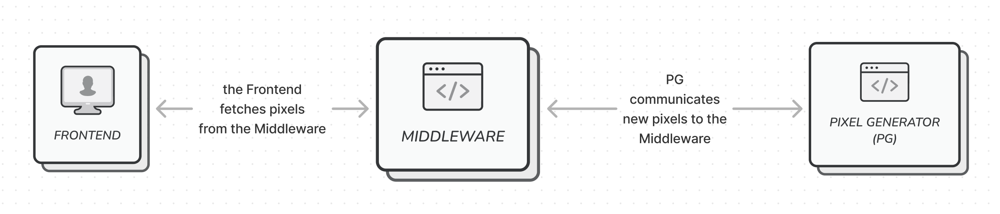

# CS 340's Course-Wide Shared Pixel Board Middleware

This course-wide shared middleware was initially based of Sid Bhushan's Week #1 submission, with modifications added by waf from the Week #1 submissions of Yuqing, Garrett, Han, Yutong, Maya, Willie, Max Fan, Owen H., Alekhya, and Xinze.

## High-Level Overview

The full pixel board application consists of three primary components:

- **Frontend**, a static webpage using HTML/CSS and JavaScript (located in `templates` and `static`)
- **Class-wide Shared Middleware**, the Python application in this repository (see `app.py`)
- **Many Pixel Generators (PGs)**, developed by everyone in CS 340!

The middleware is responsible for maintaining the state of the current pixel board, sending the pixel data to anyone that requests it, and accepting updates from the PGs. It is an HTTP server.

The middleware's logic is primarily contained within the `app.py` file, with a `ServerManager` class created to manage PGs and a `BoardManager` class created to manage the state of the board.

The PGs are responsible for sending pixel updates to the middleware. This is done via an HTTP request. There are no other requirements of the PGs.

Note that, prior to sending pixel updates, PGs must "register" with the middleware, via an HTTP request. The middleware will then provide a token that must be sent back with every pixel update request (technical details are given below).

---

## Launching the Shared Middleware

The shared middleware requires `mongo` as a database server and all requirements in `requirements.txt`.

Install requirements, launch mongo, then the app:
- `py -m pip install -r requirements.txt`
- One of the following:
  - In console mode: `docker run --rm -it -p 27017:27017 mongo`
  - In background mode: `docker run -d -p 27017:27017 mongo`
- One of the following:
  - In HTTP mode: `py -m flask run` / `python3 -m flask run`
  - In WebSocket mode: `py app.py` / `python3 app.py`

---

## Technical API Details

All communication between the PGs and middleware occurs through HTTP requests. How the PGs send these (and their lifecycle overall) is entirely up to them and has no bearing on the API design.

---

**PUT** `/register-pg`

This is the request used to register a PG with the middleware. Every PG should initially call this request to add themself to the middleware.

Request Data: JSON containing the keys `"name"`, `"author"` and `"secret"`. The `"secret"` string can be any value right now, but must be present.

Response Status Codes: The status code `200 OK` is returned if the PG is successfully added.

Response Data: JSON containing the key `"id"`. This is the token that the the PG will need to send back with each future request.

**Note:** Calling this request twice has no effect. The name and author are used for uniqueness (as the author should be associated with a unique person and it is expected than a person who creates more than one PG will name them different things). Attempting to register another PG with the same name/author as an existing PG will just return the token for that PG. As such, this method can also be used to recover a token should it be lost by the PG.

---

**DELETE** `/remove-pg`

This request removes a PG from the middleware.

Request Data: JSON containing a single key `"id"`, containing the token used to identify the PG (from `/register-pg`).

Response Status Codes: The status code `200 OK` is returned if the PG is successfully removed.

Response Data: JSON containing a single key `"success"`, which is boolean indicating if the deletion was successful (it should always be true on a `200 OK` response).

**Note:** PGs do not actually strictly need to use this route, as removing themselves from the middleware is not necessary for the function of the application. The method remains available should a PG wish to remove their record from the database or should they need to regenerate their token (if it was leaked, for example).

---

**PUT** `/update-pixel`

This request is used by a PG to update a pixel on the board. They need to have registered first, using the `/register-pg` route. Note that this request is rate limited to restrict how fast PGs can add pixels to the middleware.

Request Data: JSON containing the following fields: `"id"` containing the token; `"row"` containing the row of the pixel to update; `"col"` containing the column of the pixel to update; and `"color"` containing the color to set that pixel to (as an index of the palette array).

Response Status Codes: If everything is okay and the pixel is updated, `200 OK` is returned as well as a `rate` indicating the number of milliseconds that must be waited until the next pixel update request. If the response has an invalid token (i.e. the PG isn't registered), `401 Unauthorized` is returned. Finally, if the PG is attempting to add a pixel too soon after the last one, `429 Too Many Requests` is returned.

Response Headers: If and only if the `429 Too Many Requests` status code is returned, a `Retry-After` header is present to indicate, in seconds, how long the PG must wait to send another pixel.

Response Data: JSON containing the key `"success"` indicating whether the pixel was added. Additionally, if `"success"` is false, there will be another key `"error"` containing error information (although this is not any more useful than the semantic value of the status code).

**Note:** This request is rate limited so that PGs have to wait in between sending pixels. There is no queueing system to add pixels after a certain time, the request is simply rejected altogether. This means that it is up to the PGs to manage how quickly they make requests. They can query the rate limit (see `/settings`) and then time themselves in between requests or use the response status codes/headers to know which pixels went through.

---

**GET** `/settings`

This method is essentially the same as specified in the project requirements, but the rate limit is also added.

Response Status Codes: If the request is successful, a `200 OK` is returned.

Response Data: JSON containing the following keys: `"width"` and `"height"` specifying the dimensions of the pixel board; and `"palette"` containing an array of hex-color codes (the indices of which are used in `/update-pixel` requests).

---

**GET** `/pixels`

This method is exactly as specified in the project requirements, but also supports ETag caching. A request to `/pixels` can only be made when a PG is able to update the pixel board.

Request Data: An `id` that contains your ID token.

Request Headers: Optionally, a `If-None-Match` header may be used to include an ETag. If the ETag matches the most recent data available, the client may use its cached copy.

Response Status Codes: If the request is successful and includes fresh data, a `200 OK` will be sent. If the data remains the same from when the client last requested it, a `304 Not Modified` will be sent instead.

Response Headers: An `ETag` header will be included that clients can use for caching.

Response Data: JSON containing a single key: `"pixels"` which will be a 2D array with the pixel data (each pixel is stored as an index of the palette, which can be obtained with `/settings`). Note that if there is an ETag cache hit, no data will be sent other than the headers.

**Note:** Due to the large amount of data sent in this request, and the potential for it not to be changed (as clients will constantly query this route), the use of caching by clients is strongly encouraged.

---

**GET** `/timelapse`

This route returns a GIF with a timelapse of the whole pixel board.

Response Status Codes: If the GIF generation is successful, a `200 OK` is sent.

Response Data: A GIF (the `Content-Type` is `image/gif`) containing an animated timelapse of the board.

**Note:** The resulting GIF does not account for the time between pixel placements (normalizing every pixel as being placed evenly across the entire time period).

**Note:** To save time/memory, the middleware does not store the state of the board after every pixel (instead only storing updates). As such, this method requires every frame to be created from scratch, so this will take a long time (especially if a lot of pixels have been added). This method should, therefore, be used sparingly.

---

**POST** `/changeByClick`

This route receives a json file from the frontend and updates the pixel.

Request Data: JSON containing the keys `"secret"`, `"row"`, `"col"` and `"color"`. The `"secret"` string can be any value right now, but must be present.

Response Status Codes: If everything is okay and the pixel is updated, `200 OK` is returned. If the response has an invalid token (i.e. the PG isn't registered), `401 Unauthorized` is returned. Finally, if the PG is attempting to add a pixel too soon after the last one, `429 Too Many Requests` is returned.

---

**POST** `/changePixelRate`

This route is used to update the pixel rate.

Request Data: JSON containing the keys `"new_rate"` and `"token"`.

Response Status Codes: If everything is okay and the pixel rate is updated, `200 OK` is returned. If the response has an invalid token (i.e. the PG isn't registered), `401 Unauthorized` is returned. If there are missing attributes in the json file `400 Missing attributes` is returned.

## Technical Details About Middleware

### Dependencies

The middleware uses a MongoDB database to store data. As such, one needs to be provided. This can be provided in any way (the connection information is configurable, see below). The database could be provided from a PaaS provider or managed by the user themselves. One simple way to launch a database is to use the following Docker command: `docker run -d -p 27017:27017 mongo`.

There are a number of Python packages used by the middleware, namely Flask (as a web framework), pymongo (for the database connection), dotenv (to manage environment variables), and Pillow/numpy (for the GIF generation). These can all be found in the `requirements.txt` file.

### WebSocket Support

Instead of using active pulling, after the initial state is transferred via `GET /pixels`, all updates are sent using WebSockets (specifically, `socket.io`). Since `socketio` gives server ability to actively emit event to client, the front-end could update the pixel in real-time while using least bandwidth. The `socketio` is also faster at communicating.

To use `socketio`, you must have all requirements installed in `requirements.txt` **AND** run it using `python app.py` instead of with `flask run`.

### Environment Variables

There are a number of configurable components to the middleware that should be specified through environment variables. All environment variables have reasonable hard-coded default values. These can either be loaded as environment variables prior to the program's start (using whatever mechanisms are provided by the OS) or placed into a `.env` file (from where they will be loaded at startup.)

A summary of the environment variables is given below:

- `MONGO_HOST` and `MONGO_PORT` specify the host and port, respectively, of the MongoDB instance.
- `TEMP_DIR` specifies the location of a temporary directory the middleware can create, write to, and read files from. This is used to store the files sent by the `/timelapse` route.
- `INITIAL_WIDTH` and `INITIAL_HEIGHT` specify the initial dimensions of the pixel board.
- `INITIAL_PALETTE` specifies the initial palette used, as a comma separated list of hex color codes (_without_ a precedeing `#`).
  - For example, the following is the string corresponding to the initial 16 colors available in the 2022 version of Reddit's r/place: `ffffff,d4d7d9,898d90,000000,9c6926,ff99aa,b44ac0,811e9f,51e9f4,3690ea,2450a4,7eed56,00a368,ffd635,ffa800,ff4500`.
- `PIXEL_RATE` specifies the number of milliseconds between pixel updates that are permitted for a specific PG.
- `CHANGE_PIXEL_RATE_TOKEN` specifies the secret token for updating pixel rate, should be private to administrator.

### Secrets

Secrets are used when a PG registers itself. Each PG should have a secret that matches one found in a hidden file `secrets.json`.

`secrets.json` should include a JSON list with the name "secrets", like this:
`{"secrets" : ["first", "second", "taylor", "mm isn't here"]}`
